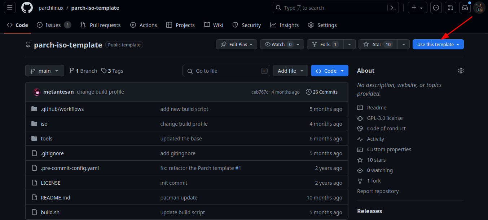
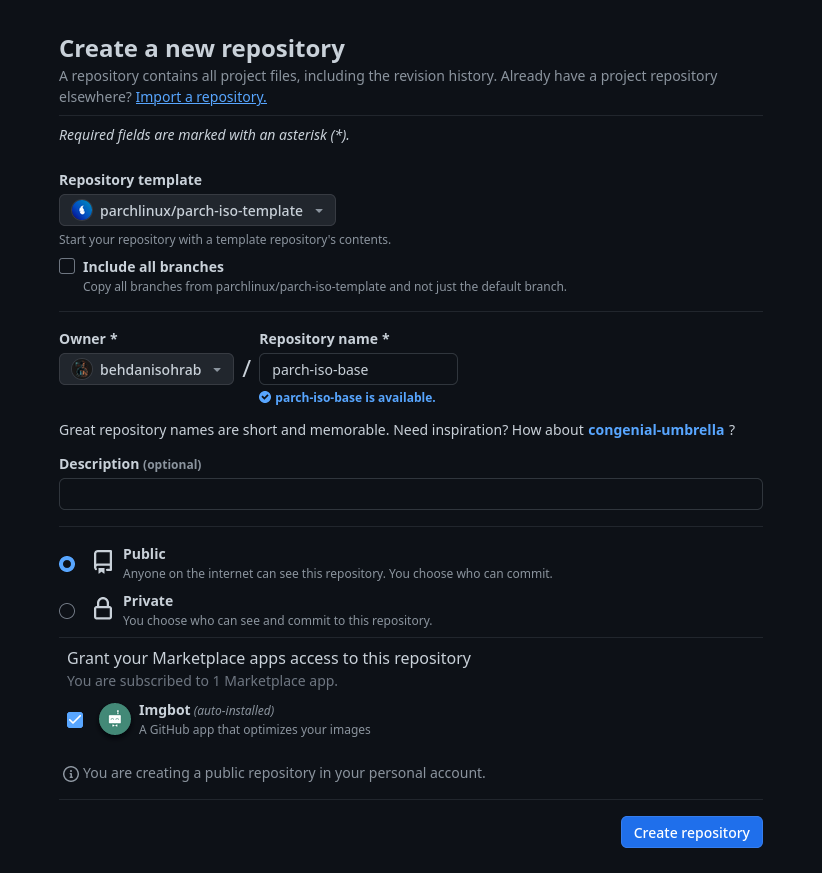

# Start making changes!

First of all you need to use Parch Linux template repository to make a new repository.

## How to make a repo using template?

Currently all of Parch Linux Development is placed on github, first of all you need a github account and enable [ssh](https://docs.github.com/en/authentication/connecting-to-github-with-ssh) on your github account.

After making An account, open the Parch Linux template repository page using this [link](https://github.com/parchlinux/parch-iso-template)

then on the page click on use this template button and select create new repository.

Then in the next page set a name for your repository.

**Note**

We recommend you to set names as for example: parch-iso-$(desktop) if you want to submit it as a community iso later.

After setting the name click on create repository button.

